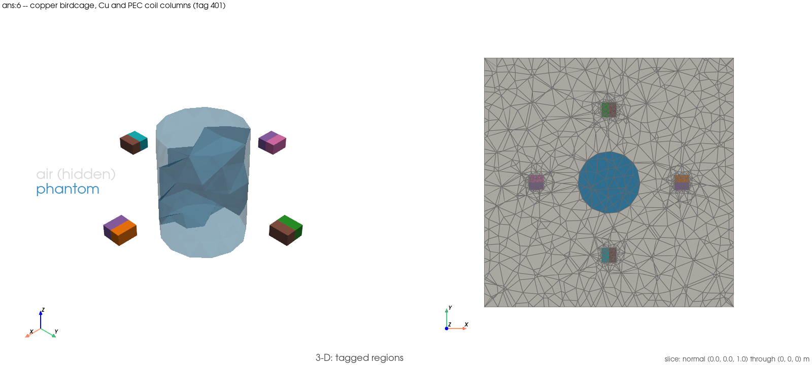

# `ans:6` — copper birdcage, four lumped ports: Cu and PEC columns, 10/64/128 MHz

Script: `examples/ansys_benchmarks/ans6_copper_birdcage_four_port_10_64_128MHz/06_copper_birdcage_four_port_10_64_128MHz.py` (`ANS-6`)
Gates: `tests/validation/test_th14_birdcage_copper.py` (`TH-14` step 2, Cu) and
`tests/validation/test_th15_birdcage_pec_hole.py` (`TH-15` step 3, PEC)
Authority: `SPEC.md` beside this file — the boundary-value problem the human
operator replicates in Ansys Electronics Desktop.

## 1. What this demonstrates

`ANS-6` is the fifth commissioned AED benchmark and the first with a
realistic conductor: the `ANS-4` fixture (gapped four-leg birdcage, phantom
loaded, four lumped-sheet ports) with the coil's exterior surface treated
either as HFSS **Finite Conductivity** at σ = 5.8e7 S/m (copper, `TH-14` step
2's Leontovich third-kind boundary term, Jin §1.5.3/§5.8.3) or as **Perfect
E** (PEC, `TH-15` step 3's "coil as a hole"). This script produces the
runnable half: our own S/Z, the loss partition, the σ-ladder negative
control, and a PEC cross-check — everything the SPEC's "Runnable half" box
asks for, ready for the operator to fill the AED columns beside.

**It asserts, it does not re-implement.** The only change either gate module
needed was additive and disclosed: `TH-14`'s `ladder` fixture body is lifted,
byte-for-byte, to a module-level `_build_ladder()` so this script can call it
directly instead of through pytest's fixture machinery (rule (a), the
`EX-32`/`EX-33` precedent) — nothing below the new one-line wrapper moved or
changed, and `TH-14`'s own gate suite is re-run green in the same slot.
Every band, record and construction — `_build_ladder`, `_build_ports`,
`_outer_box_tags`, `_problem`, `_leontovich_term`, `COPPER_SIGMA`,
`SIGMA_LADDER`, `PREDICTED_PEC_LIMIT_MAX_ABS_DS`, `CLASSES`, `DRIVEN`,
`OUTER_BOX_TAG`, `FREQUENCIES_HZ`, `DISCRETE_IDENTITY_RTOL`,
`RECIPROCITY_BAND`, `PASSIVITY_SIGMA_TOLERANCE`, `ADJACENT_SPREAD_BAND`,
`REFERENCE_IMPEDANCE_OHM`, `TERMINATED_PORT_IMPEDANCE_OHM`, `LEG_COUNT`, and
`TH-15`'s own `_hole_rung` — is imported from the module names the gate
modules themselves use, never restated (`ANS-1`'s rule).

**The case.** One mesh (the hole fixture, coil cut from the mesh), built
twice: once by this script (for the setup figure and the 128 MHz export
solve) and once inside `TH-14`'s own `_build_ladder()` (a fresh, independent
call). `_build_ladder()` already carries **both** columns per frequency — the
copper Leontovich sweep (`sigma[COPPER_SIGMA]`) and the PEC reference it
documents as "`TH-15` step 3's fixture verbatim" (`pec`) — plus the σ-ladder
negative control and the P1 copper power accounting. This script reads both
columns off that one call and, as an independent cross-check specific to the
PEC column, calls `TH-15`'s own `_hole_rung` at 10 MHz on a *third*,
separately built mesh.

**No absolute copper-coil or PEC-coil accuracy claim.** The gates are
self-consistency identities on one fixture (`PORT-11`, PROJECT_PLAN §2.2); no
resonance, tuning or absolute accuracy is claimed, and no absolute `S₁₁` /
`Z_in` figure at 10 or 64 MHz (`PORT-21`, known-issues 2026-09-19).

## 2. How to run it

Needs the complex DolfinX build; the runner sources it for the `ans:` group
automatically.

```
./run_examples.sh -e ans:6 -n 2 -t 590
```

Verification runs go through the logging harness with the runner's emitted
command (`./scripts/run_examples.sh -e ans:6 --dry-run`), never with the host
runner wrapped inside `docker compose exec` (Status 127). Add
`-e FEM_EM_SETUP_FIGURES=1` after `exec -T` to re-render the setup figure.

Because this item also lifted `TH-14`'s fixture body (rule (a)), the gate
suite it changed is re-run separately:

```
docker compose exec -T fem-em-solver bash -lc 'cd /workspace && source /usr/local/bin/dolfinx-complex-mode && PYTHONPATH=/workspace/src mpiexec -n 2 python3 -m pytest tests/validation/test_th14_birdcage_copper.py -v --tb=short -s'
```

Tier: **heavy** (measured 167 s at `-n 2`, well under the 590 s ceiling —
`TH-14`'s own gate re-run measured 103 s for all three frequencies, much
cheaper than its originally quoted 340 s three-frequency window).

## Setup figure



`examples/ansys_benchmarks/ans6_copper_birdcage_four_port_10_64_128MHz/figures/ans6_copper_birdcage_four_port_10_64_128MHz_setup.png`,
rendered right after this script's own mesh build
(`FEM_EM_SETUP_FIGURES=1`): air hidden, the phantom translucent, the slice
normal to `z` showing the phantom and the four port sheets — the coil itself
is a hole in the mesh (tag 401 is a boundary, not a region), so it draws as
absence, not a solid.

## 3. What it read on the run that landed it

`docs/testing/logs/20260920T124620Z_ANS-6.log` (flagged with
`FEM_EM_SETUP_FIGURES=1`, `-n 2`, Status 0, elapsed 167 s;
`[capture] rc=0` at the footer). `TH-14`'s own gate suite, re-run in the same
slot after the additive lift:
`docs/testing/logs/20260920T123746Z_ANS-6-TH14-gate-relift.log` (11 passed,
Status 0, 101.62 s).

| reading | this run (`:2143`, `:3001-3010`) | `TH-14` gate re-run (`:1025,1171,1317`) |
|---|---|---|
| mesh | 80 181 cells, mesh+ports 21.6 s | same fixture (`_sheets_build(True, as_hole=True)`) |
| `_build_ladder()` | 103.3 s | 101.62 s for all 11 tests |
| 10 MHz `P_coil/P_in` | 9.288392e-01 | 9.288392e-01 |
| 64 MHz `P_coil/P_in` | 4.483664e-01 | 4.483664e-01 |
| 128 MHz `P_coil/P_in` | 2.186740e-01 | 2.186740e-01 |
| PEC cross-check @ 10 MHz (`_hole_rung` vs `TH-14`'s embedded `rec["pec"]`) | worst rel 3.331e-13 (band 1e-8) | — (not run by `TH-14`'s own suite) |
| copper surface-loss identity residual | 1.571e-13 / 2.958e-13 / 7.022e-14 (10/64/128 MHz) | band `DISCRETE_IDENTITY_RTOL` = 1e-6 |
| Cu reciprocity / PEC reciprocity | ≤ 1.4e-14 / ≤ 8.5e-15 (all 3 freq) | band `RECIPROCITY_BAND` = 1e-3 |
| Cu σ_max / PEC σ_max | ≤ 0.999994231 / ≤ 0.999994234 | band ≤ 1 + 1e-9 |
| negative control (PREDICTED): σ=5.8e11, `max\|S−S_PEC\|` | 2.368e-06 / 4.197e-06 / 3.186e-06 | predicted ≤ `PREDICTED_PEC_LIMIT_MAX_ABS_DS` = 1e-4, **met** at all 3 |
| `\|S(Cu)−S(PEC)\|` per class (10 MHz, printed) | self 2.360e-04, adjacent 6.117e-05, opposite 1.143e-04 | printed only, no band |

The `P_coil/P_in` figures match the SPEC's reference table (0.929 / 0.448 /
0.219) and `TH-14`'s own log to every printed digit — expected, since this
script reads them directly off `TH-14`'s own `_build_ladder()`, called fresh
in this run rather than re-derived. A miss here would be an example/test
**divergence** (a known-issues entry naming this example and a stop, never a
re-record from the example side); none occurred.

## 4. How to analyze it, step by step

**Step 1 — read the fixture line (`:866`).** Cell count (80 181) and the
outer-box census (exterior facets split into the cavity wall, tag 401, and
everything else) — the same fixture `TH-14` and `TH-15` gate.

**Step 2 — read `[ANS-6] TH-14 _build_ladder()` (`:2143`).** One call to
`TH-14`'s own fixture builder, all three frequencies, both columns, in one
window.

**Step 3 — read the PEC cross-check (`:3001`).** `TH-15`'s independently
built and solved `_hole_rung` at 10 MHz compared to `TH-14`'s *embedded* PEC
reference (built from the same code path, on a separate mesh instance) —
worst relative deviation 3.331e-13 against the script's own
`PEC_CROSS_CHECK_RTOL` = 1e-8. This is the item's literal "PEC column
imported from `test_th15_birdcage_pec_hole.py`" anchor: two independent
builds of "the coil as a hole" agreeing to 13 digits is what licenses
treating `TH-14`'s embedded PEC sweep as equivalent to `TH-15`'s own gated
route, for every frequency this script reports.

**Step 4 — read the per-frequency line (`:3002,3005,3008`).** Reciprocity,
passivity (`σ_max`) for both columns, and `P_coil/P_in` / `P_phantom/P_in`
for copper — all against the imported bands.

**Step 5 — read the negative control (`:3003,3006,3009`).** *Predicted*
(rule (e)): at σ = 5.8e11 S/m, `TH-14`'s own σ-ladder puts
`max|S_σ − S_PEC|` at or below `PREDICTED_PEC_LIMIT_MAX_ABS_DS` (1e-4) —
printed, never asserted, exactly as `TH-14` treats it; met at all three
frequencies here by roughly two orders of magnitude.

**Step 6 — read the column difference (`:3004,3007,3010`).** *Predicted,
printed only:* `|S(Cu) − S(PEC)|` per C4 class — the quantity the conductor
model actually adds over a PEC assumption, per the SPEC's primary
adjudication row (c). Not a gate.

**Step 7 — open `metrics.json` and `COMPARISON.md`.** `metrics.json` carries
the full complex 4×4 `Z`/`S` for both columns at all three frequencies;
`COMPARISON.md` is the SPEC's export tables with the "Ours (FEM)" column
filled and both AED columns blank by construction — never populated from
this tracked file (Ansys licence terms, `ANS-1`).

**Step 8 — open the mesh in ParaView.**
`paraview_output/ans6_copper_birdcage_four_port_128mhz_combined.xdmf` — the
port-1-driven copper case at 128 MHz, `E_real`/`E_imag`/`E_magnitude` (CG1)
and `B_magnitude` (DG0, Faraday's law), beside `CellTags`. One extra P1 solve
(4.2 s) supplies this field — the sweep itself returns port quantities, not
fields (`EX-20`'s named limitation, carried by every case in this directory).

**Step 9 — what a deviation means.** Every gated anchor is imported from
`TH-14` step 2 or `TH-15` step 3's gate modules, so a miss through this
script's path is an example/test divergence, not a new physics finding — a
known-issues entry naming this example and a stop, never a loosened band and
never a re-record from the example side.

## Related

- `ANS-4` (the PEC-less, homogeneous-conductor-free predecessor fixture):
  `examples/ansys_benchmarks/ans4_birdcage_four_port_10_64_128MHz/`.
- The copper Leontovich surface-loss field on one frequency:
  `examples/ports/18_birdcage_copper_leontovich.md` (`EX-59`).
- `TH-14` step 2's gate module: `tests/validation/test_th14_birdcage_copper.py`.
- `TH-15` step 3's gate module: `tests/validation/test_th15_birdcage_pec_hole.py`.
- `PORT-21` (the self-class feed systematic; no absolute `S₁₁`/`Z_in` claim
  at 10 or 64 MHz), known-issues 2026-09-19.
