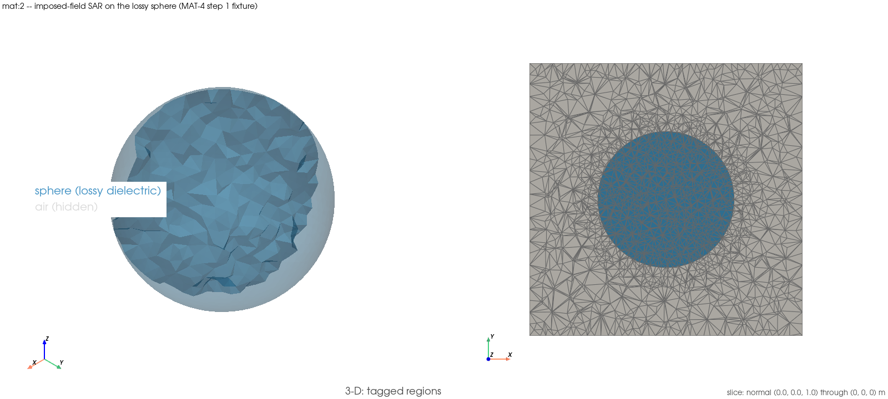

# `-e mat:2` — imposed-field SAR on the lossy sphere against its closed form

Guide for `examples/materials/02_lossy_sphere_sar.py`.
Written to be followed without the source open.

## 1. What this demonstrates

**The `MAT-4` step 1 gate — SAR against a closed form on an imposed uniform
field — has never had an example of its own.** `th:6` shows the lossy plane
wave, `mri:2` shows the mass-averaging *operator* on an imposed field with no
closed-form SAR target, and `ports:9` shows coil-driven quadrant powers with
no closed form at all. This is the missing member of Phase 3's SAR ramp — the
2026-09-06 weekly review's audit found it short one example — and it closes
that gap: a lossy sphere in a uniform 64 MHz field, its interior field known
in closed form, its SAR checked against that closed form.

The quantity is

```
SAR = sigma |E_in|^2 / (2 rho),   E_in = 3 E0 / (eps_c + 2),   eps_c = eps_r - j sigma/(w eps_0)
```

the quasi-static interior field of a dielectric sphere in a uniform applied
field, continued onto the imaginary axis of `eps_c` so the sphere is lossy.
Every constant, mesh resolution and closed form is **imported** from
`tests/validation/test_lossy_sphere_sar.py` — the module that closed `MAT-4`
step 1 — so this example and that gate cannot drift apart. The one change to
that module is additive and disclosed: `_solve_lossy_sphere` grew a
`return_fields=False` keyword (default off, every existing caller unaffected)
that, when `True`, also returns the mesh/cell_tags/fields the pre-existing
return dict does not carry — needed here only to write the ParaView export.

**Imposed uniform field, no coil, no mass averaging, no Larmor-coil claim.**
The uniform field enters as boundary data on the box wall (exterior uniform +
dipole solution); the interior field the solver produces is what is checked.
Nothing here drives a coil, averages over a mass, or claims anything at the
Larmor frequency beyond this gate's own scope (PROJECT_PLAN §2.1).

**64 MHz, R = 10 mm, eps_r = 78 (saline-like), fine mesh rung only**
(`SPHERE_RADIUS/10`, `SPHERE_RADIUS/5` — the gate's coarse rung exists to show
refinement, which is not this example's job). Two conductivities,
`SIGMA_LOW = 0.05 S/m` and `SIGMA_HIGH = 0.57 S/m`, plus a third solve at
`sigma = 0` (vacuum) purely for the second negative control.

This example closes nothing new; it is a Phase-3 §5.4 ramp backfill for an
already-closed gate.

## Setup figure



*Left:* the fixture (`_solve_lossy_sphere` →
`MeshGenerator.sphere_in_box_domain`) with the air box (tag `2`) hidden and
the sphere (tag `1`, `SPHERE_TAG`) translucent blue — the same
`sphere_in_box_domain` mesh `mri:2` already pictures, since both examples
share the fixture. There is nothing else inside the sphere to reveal by the
translucency here (no second conductor, no coil); it is drawn translucent by
the same one-object-class convention. *Right:* the slice at `z = 0`, the
mesh centre and the equatorial plane the interior `E_z` closed-form
comparison (§1, §3 step 2) is made on — the sphere's cross-section sits
centred in the square air-box cross-section, grey outside and blue inside.
There is no second geometry to picture as a control — the in-fixture
negative controls (§1, §3 steps 3–4: the two-sigma ratio and the `sigma = 0`
vacuum solve) run on the same mesh, not a second one.

## 2. How to run it

```
./run_examples.sh -e mat:2 -n 2 -t 300
```

**Complex build required** — the `mat:` group sources it automatically, and a
real build raises with a message naming `/usr/local/bin/dolfinx-complex-mode`.
Tier: **standard**. The gate's four solves (two sigma x two mesh rungs) ran
40 s at `-n 2`; this example's three solves (two sigma at the fine rung plus
the vacuum control) and one XDMF write cost about the same order.

## 3. How to analyze it, step by step

**Step 1 — mean SAR against the closed form, at both conductivities. This is
the anchor.**

```
[sigma = 0.05 S/m] closed-form SAR = ... W/kg, measured mean SAR = ... W/kg (X.XX% vs 10% bound)
[sigma = 0.57 S/m] closed-form SAR = ... W/kg, measured mean SAR = ... W/kg (X.XX% vs 10% bound)
```

Both errors must sit under the **10%** bound imported from the `MAT-4` step 1
gate — a bound whose own floor is the closed form's O((k_in R)^2) retardation
error (printed as `|k_in|R` alongside), not a fitted mesh tolerance. The
plan's own printed record for these two numbers is **3.42% / 3.54%** — the
run prints its own reproduction beside that record for comparison, but the
assertion is only the imported 10% bound, never those two figures; the record
is a plan annotation, not a module constant, so an exact match is not
expected digit for digit at this fine rung alone (the gate reproduces it via
both rungs together).

**Step 2 — interior uniformity and phase, at both conductivities.**

```
E_z spread = X.XX% (bound 2%)
Im/Re E_z measured X.XXXX vs closed X.XXXX
```

The closed-form interior field is spatially uniform, so the FEM field's
spread across the interior probe points must stay under the gate's own 2%
bound. The `Im/Re E_z` check is the one that would catch a solver that
silently dropped the `-j sigma/(w eps_0)` loss term from `eps_c`: such a
solver would still pass a magnitude-only SAR check (within the sigma-blind
control's 2.5x) while returning zero phase.

**Step 3 — negative control 1: the two-sigma ratio, asserted.**

```
[control 1] two-sigma ratio: FEM X.XXXX, closed form X.XXXX, sigma-blind X.XXXX
            => separation X.XXXx (ceiling 4.86x, module's own arithmetic, printed not asserted)
```

A solver blind to sigma returns `E_in` independent of sigma, so its
`SAR2/SAR1` ratio is exactly the sigma-blind ratio `sigma2/sigma1 = 11.40`.
The honest solver's ratio separates from that by the printed factor, which
must clear the gate's own **>= 3x** floor. The ceiling
`((eps_r+2)^2+t2^2)/((eps_r+2)^2+t1^2) = 4.86` is the module's own arithmetic,
printed for context and never asserted — it is a ceiling, not something to
clear.

**Step 4 — negative control 2: the vacuum sphere, asserted exactly.**

```
[control 2] sigma = 0 (vacuum): dissipated_power_w = 0.000000e+00 W, mean SAR = 0.000000e+00 W/kg
```

With sigma identically zero cell by cell, the SAR integrand is zero cell by
cell — the assertion is `dissipated_power_w == 0.0` exactly (no tolerance)
and `mean SAR <= 1e-12`. Anything else means sigma is leaking into a region
this run thinks has none.

**Step 5 — open it in ParaView.**
`File → Open → examples/materials/paraview_output/materials_02_lossy_sphere_sar_combined.xdmf`

1. **Threshold** on `CellTags == 1` (the sphere) to isolate the region either
   SAR array is defined over.
2. **Clip** through `y = 0` and colour by `SAR_pointwise` (the FEM field,
   `sigma|E|^2/(2 rho)` evaluated at cell centroids and evaluated at
   `sigma = SIGMA_HIGH`) side by side with `SAR_closed_form` (the flat
   constant closed-form value on the same cells). The two should look nearly
   identical in colour range — visually, the ~3.5% difference this example's
   Step 1 measures.
3. `SAR_pointwise` reads through `post.sar.point_sar`, taking the split
   `e_real`/`e_imag` fields (not `e_complex` — a signature trap already paid
   for elsewhere in this project).

**Step 6 — what a deviation means.** Mean SAR outside the 10% bound at either
sigma while `tests/validation/test_lossy_sphere_sar.py`'s own gate test still
passes is an example/test divergence, not new physics — a known-issues entry
and a stop, never a loosened assertion. `E_z` spread or phase ratio outside
bound similarly points at the example's wiring, since the gate module itself
is re-run green in the same slot. Either negative control failing (the
two-sigma separation, or a non-zero vacuum SAR) means sigma is not entering
the assembled operator or the tagged sphere region the way this example
believes it is.

## Related

- The gate this example runs:
  `tests/validation/test_lossy_sphere_sar.py` (`MAT-4` step 1), and
  PROJECT_PLAN.md §7 for its record.
- The lossless continuation of the same closed form: `TH-8`
  (`|Im E_z|/|Re E_z| < 1e-6` at sigma = 0).
- The mass-averaging operator on a different imposed field:
  `examples/mri/02_mass_averaged_sar.py` (`mri:2`, `EX-3`).
- Coil-driven quadrant SAR powers on the birdcage:
  `examples/ports/09_birdcage_sar_quadrant_powers.py` (`ports:9`).
- Why no Larmor-coil claim is made here: PROJECT_PLAN.md §2.1.
