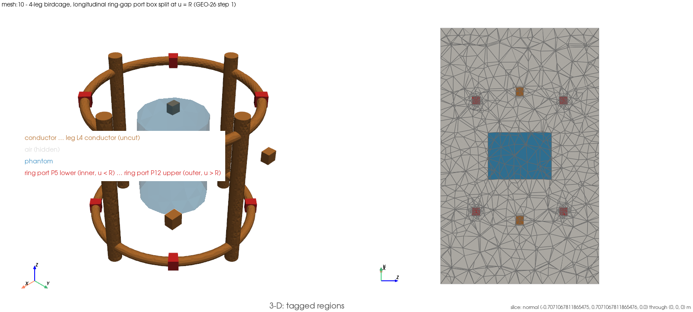

# `mesh:10` — the longitudinal ring-gap port sheet, in ParaView

Script: `examples/meshing/10_birdcage_ring_sheet_longitudinal.py` (`EX-44`)
Gate: `tests/mesh/test_birdcage_ring_sheet_orientation.py` (`GEO-26` step 1, ✅ 2026-09-03)

## 1. What this demonstrates

`GEO-26` step 1 gated a new keyword on `MeshGenerator.birdcage_port_domain`:
`ring_sheet_orientation="longitudinal"`. Every ring-gap example that existed
before it — `mesh:7` (`EX-31`) and `mesh:9` (`EX-35`) — shows only the
*default* **transverse** section of a ring gap: the `w × w` rectangle at
`phi = phi_c`, normal `phi_hat`, whose extent along its own drive direction is
**zero** to machine precision. `PORT-13` step 1 measured that directly
(`≤ 1.43e-17` m on all eight sheets) and found it un-terminable: the
lumped-sheet port model divides by that extent (`R_s = Z_p·w/h`), so `h = 0`
is a well-posedness gap, not a solver bug. No example showed the sheet the
port model can actually drive. This one does.

The **longitudinal** sheet is a different planar rectangle: it lies in the
plane `u = ring_radius` (normal `û(phi_c)`), spans the gap's **chord**
`2R·tan(alpha)` along `phi_hat` and `w = ring_port_box_width_m` along `ẑ`. Its
four edges lie on the port box's two radial caps and its two `z` faces, so it
spans the box and splits it into an inner (`u < R`, cell tag `100+i`) and
outer (`u > R`, `200+i`) half with closed-form volumes
`w·tan(alpha)·(R·w ∓ w²/4)`.

### Chord, not arc

The box's radial caps are planar, so what they actually deliver is the
**chord**, not the arc `ring_gap_length` a gap is specified by. At this
fixture's `g = 0.008 m` / `R = 0.07 m` the two differ by **+0.10%**
(`8.008718871e-03` m chord vs `8.000000000e-03` m arc) — both diagnostics are
emitted by the generator and both are printed here.

### One measured difference, not absorbed

The longitudinal sheet's two `phi` edges are **diameters** of the two
terminal disks (the transverse sheet sits mid-gap and touches neither), so
the inscribed triangulation of a terminal is constrained differently. Every
terminal still lands inside the `[0.95, 1.0]` closed-form band and every
*exact* (polyhedral) identity — sheet area, port volume, both halves, the C4
spread — is untouched, but the terminal C4 covariance moves from `4.198e-08`
(transverse) to `1.605e-05` (longitudinal). `TERMINAL_INTRA_CLASS_BAND`
(`1e-6`) is not widened for this; `_assert_ring_identity_family` takes a
`terminal_intra_band` keyword and only this call site passes the measured
`LONGITUDINAL_TERMINAL_INTRA_BAND = 2.0e-5`.

### It asserts, it does not merely render

Every anchor here is imported from the gate module and read off *this run's
own mesh* (the `ANS-1` rule):

- both meshes' cell counts against their own record (`RING_LONGITUDINAL_CELL_RECORD`
  111 898, `RING_GAP_CELL_RECORD` 110 786, both at `CELL_COUNT_BAND`);
- `_assert_ring_identity_family` — the whole `GEO-20` step 1 family (partition,
  air-box closure, Pappus arcs, terminal ratio band, C4 sheet spread and
  top/bottom mirror) plus the chord/`w`/half-volume identities the
  longitudinal mode adds — green on the subject at its own measured band and
  on the control at the function's default band;
- the negative control below.

### Scope

**Mesh only.** No port model, no drive, no solve, no `GEO-20` record moves, no
§2 change. **Only the 4-leg rung is shown** — the 16-leg longitudinal rung
(`GEO-26` step 2) hit a pre-registered stop (two of its four azimuth classes'
terminal covariance exceeds the unmoved `2.0e-5` band) and is a deliberate red
on `main` with its own known-issues entry; nothing about it is claimed or
built here.

## Setup figure



*Left:* the **longitudinal (subject) rung**'s tagged regions
(`_measure_ring(CONTROL_LEG_COUNT, orientation="longitudinal")`, `GEO-26`
step 1's newly gated capability) with the air box (tag `2`) hidden and the
saline phantom (tag `3`) translucent. The four copper rods and the two end
rings are the bulk conductor, tag `1`; the free-standing copper cubes are
the four floating leg boxes (tags `101`-`104`, uncut — no gap in the legs,
so no terminals and nothing to split — named `leg L{i} conductor (uncut)`
so they take the `conductor` colour class); the eight ring-port boxes (tags `105`-`112` = the inner
(`u < R`) half and `205`-`212` = the outer (`u > R`) half, the `port`
colour class, red) sit at the four gap azimuths (`45/135/225/315` deg) on
both end rings — six are unoccluded from the default isometric angle, the
remaining two sit behind the near ring/leg geometry from this view. No
`clip_normal`: every port sits on the coil's outer periphery with nothing
in front of it to hide. *Right:* the slice on the vertical plane through the
coil axis and the on-plane gap pair at `45°`/`225°`
(`slice_normal = phi_hat(45°) = (-0.7071067811865475, 0.7071067811865476,
0.0)`, `slice_origin = (0, 0, 0)`) — not a `z`-normal slice near a ring's
own axial centre, which `mesh:9` (`EX-57`, 2026-09-21 09:00 slot) found
empty of ring band at a 1 mm offset because a horizontal cut barely grazes
a torus whose minor radius is 4 mm. `phi_hat(45°)` is exactly the sheet's
own chord direction at that azimuth, so slicing on the plane it spans
(`u_hat`, `ẑ`) cuts straight across the sheet instead of running parallel
to it, and reads the `u = R` split as a line rather than hiding it
edge-on. The pale grey field is the air box — still drawn in the slice
panel per `write_setup_figure`'s own convention even though it is hidden
from the 3-D panel — and the blue rectangle at the centre is the phantom's
own cross-section on the coil axis (`z` runs horizontally in this panel,
per its axis widget). The four red patches are the ring-port
cross-sections, **two per ring** — this plane carries both the `45°` and
the `225°` gap of each end ring — and the two copper squares at mid-length
are leg-box cross-sections (a rod would cut as a strip along `z`, not a
square). Rendered by `fem_em_solver.post.setup_figure.write_setup_figure`
immediately after `_measure_ring` returns the longitudinal rung and before
`_report_safely` or the transverse control build, so the render never
enters the printed `elapsed`/`mesh_wall_time_s` timers; regenerate with
`FEM_EM_SETUP_FIGURES=1` in the runner's environment.

## 2. How to run it

```
./run_examples.sh -e mesh:10 -n 2 -t 300
```

Real DolfinX build (no complex mode needed); the runner selects it. Tier:
**standard**.

## 3. How to analyze it, step by step

**Step 1 — read the two cell counts.** The longitudinal mesh reads
`111898` cells against `RING_LONGITUDINAL_CELL_RECORD` (ratio `1.000000`);
the transverse control reads `110786` against `RING_GAP_CELL_RECORD` (ratio
`1.000000`). Different sheets are a different `dim-2` fragment tool for
gmsh, so the counts genuinely differ — this is not the same mesh printed
twice.

**Step 2 — read the chord vs. the arc.** `chord/arc = 1.001089871`: the
longitudinal sheet's radial caps are planar, so the sheet is 0.10% wider than
the nominal gap length. This is the mechanism, not a discretisation error —
both numbers are closed forms.

**Step 3 — read the per-port table.** Eight rows, one per ring port (both end
rings, four gaps each):

- `longitudinal phi_hat/chord` — should read `1.000000000000` on all four:
  the sheet spans the full chord along the drive direction, to `1e-9`.
- `z/w` — should also read `1.000000000000`: the sheet spans its box in `ẑ`.
- `V_in/analytic` and `V_out/analytic` — both `1.000000000000`: the sheet
  really does cut the box into the two closed-form halves that sum to
  `ring_port_volume_m3`.
- `transverse phi_hat extent` — the same port's *default* sheet, printed
  beside it: `~1e-17` m, fourteen decades below the longitudinal chord.

**Step 4 — the identity family.** `_assert_ring_identity_family` re-reads,
on both meshes, the `GEO-9` tagged-volume partition, the analytic air box,
the Pappus arcs on the ring primitives, the graded-conductor CAD-mass gate,
the per-port boundary closure and wedge volume, the terminal ratio band, and
the C4 sheet spread / top-bottom mirror. On the longitudinal mesh the
terminal covariance is read against `LONGITUDINAL_TERMINAL_INTRA_BAND`
(`2.0e-5`, the measured constrained-triangulation effect); on the transverse
control it is read against the function's own default (`1e-6`).

**Step 5 — the negative control.** Every transverse sheet's `phi_hat`
extent must sit below `DEGENERATE_EXTENT_M` (`1e-12` m) while every
longitudinal sheet's ratio to the closed-form chord is `1.000000000` and the
longitudinal/transverse extent ratio exceeds `1e13`. If this ever failed, the
opt-in would have leaked into the default emission, or the longitudinal sheet
would not actually span the drive direction.

**Step 6 — open the mesh in ParaView.** `File → Open →`
`examples/meshing/paraview_output/meshing_10_birdcage_ring_sheet_longitudinal_combined.xdmf`
— one file, carrying both the cell grid and the sheet facet grid. `OPS-38`
folded the sheets into the combined file; the separate facet file this rung
used to write alongside it is gone.

- Threshold `CellTags` in the `_combined` file: `1` conductor, `2` air, `3`
  phantom, `101-104` the four uncut leg boxes, `105-112` / `205-212` the
  inner/outer halves of the eight ring gap boxes (both end rings, four gaps
  each).
- Threshold `105` and `205` separately (one ring port): the flat radial
  interface between them, at `u = ring_radius`, *is* that port's longitudinal
  sheet.
- In the same file's facet block, threshold `mesh_tags` to `215-222`. Those are the
  eight sheets themselves — planar rectangles lying in the `u = R` plane, each
  running the gap's full chord along `phi_hat` and through both terminal
  disks' centres along `ẑ`, unlike the mid-gap transverse sheets `mesh:7` /
  `mesh:9` show.

**Step 7 — what a deviation means.** Nothing is solved here, so every failure
mode is a geometry or tagging defect:

- **A cell-count miss** — a wiring defect in this example, not the mesh
  (`GEO-26` step 1 already gates the generator); journal in the `EX-44` §7 row
  and stop, do not re-record from this side.
- **A `phi_hat`/chord ratio off `1e-9`** — the longitudinal sheet does not
  span the gap, so the `h` it would offer a port model is not the chord.
- **A transverse `phi_hat` extent above `1e-12` m** — the opt-in leaked into
  the default emission.
- **A terminal-band miss above `2.0e-5`** on the 4-leg rung — a genuine
  regression in the constrained-diameter triangulation; do not widen the band
  (PROJECT_PLAN §7, MAG table, defect 5).

## Related

- The gate itself: `tests/mesh/test_birdcage_ring_sheet_orientation.py`
  (`GEO-26` steps 1–2).
- The default (transverse) sheet at four legs:
  `examples/meshing/07_birdcage_ring_gap_ports.md` (`EX-31`, `GEO-20` step 1).
- The default sheet at sixteen legs, 32 ring ports:
  `examples/meshing/09_birdcage_sixteen_ring_gaps.md` (`EX-35`, `GEO-20`
  step 2) — the longitudinal analogue at that leg count is `GEO-26` step 2's
  own unresolved red and is not shown anywhere yet.
- What the sheet is eventually for: `PORT-13` in PROJECT_PLAN.md §7 — blocked
  until a review adjudicates the 16-leg terminal-triangulation finding; no
  port or solve claim is made here at any leg count.
