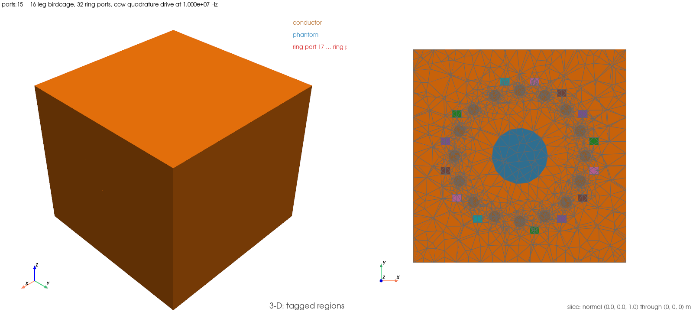

# `ports:15` — the 32-port ccw quadrature drive on the 16-leg birdcage

Guide for `examples/ports/15_birdcage_sixteen_leg_quadrature_b1.py` (`EX-55`).
Written to be followed without the source open.

## Setup figure



*Left:* the ring rung's tagged regions — the copper conductor (tag 1, legs
and rings) and the saline phantom cylinder (tag 3, translucent); the 32 ring
gap ports (tags 227–258, one per 22.5° slot on each ring) are drawn in their
own colours. *Right:* the z = 0 slice through every region. Rendered by
`fem_em_solver.post.setup_figure.write_setup_figure` from the example's own
mesh (`EX-57`); regenerate with `FEM_EM_SETUP_FIGURES=1` in the runner's
environment. Some untagged mesh-generator scaffolding tags print as `?` in
the harness log's region list — they carry no ``region_names`` entry and are
drawn but not labelled; they are not phantom, conductor, or a port.

## 1. What this demonstrates

The 16-leg / 32-ring-port birdcage (`GEO-26` step 2's rung, `PORT-13`'s
fixture) driven in ccw quadrature through the *package* superposition entry
point — `superpose_drives` with `quadrature_phase_weights` applied per ring,
the same route `POST-6` step 3 built to extend the 4-leg quadrature drive
(`ports:7`, `ports:13`) to this larger fixture. No earlier example drives
this fixture at all; `ports:13`'s quadrature drive is the 4-leg one.

Everything numeric here is imported from `POST-6` step 3's gate module,
`tests/validation/test_port_drive_superposition.py`, and its own upstream
imports — nothing is restated. The gate module's 32-drive build lived only
inside a module-scoped pytest fixture; this example uses the additive lift
(`_build_ring_quadrature_case`, a plain function the fixture now calls) so it
can be built outside pytest collection, per the `ANS-1` licence.

Three identities are asserted, all imported:

1. **C16 rotation spread** — the worst of the fifteen rotated-image
   comparisons of the ccw CG1 `|B1+|` map, against `C4_COVARIANCE_BAND` (5%).
2. **Mirror identity** — `|B1-|_cw(Mx)` vs `|B1+|_ccw(x)`, same band.
3. **`PORT-16`'s exact discrete power identity** — `P_src,exact = P_vol +
   P_sheet,exact` on the superposed ccw field, at `DISCRETE_IDENTITY_RTOL`
   (1e-6).

The sample set is exactly `MIN_SAMPLE_POINTS` = 50 points (the item's named
trap); the example prints the count and imports the constant rather than
hard-coding it.

**Negative control.** The §7 `EX-55` entry names no separate asserted
control; the gate module's own mis-paired cw comparison (`|B1+|_cw(Mx)` vs
`|B1+|_ccw(x)`) is printed only, never asserted — no record backs an
assertion on this fixture (§9 rule (e)). This example reproduces that same
printed-only reading rather than inventing a band the gate module itself
declines to assert.

**Scope.** One fixture, 10 MHz, degree 1, the ccw ring drive (cw is built
only for the mirror identity). No homogeneity, absolute-accuracy, resonance
or tuning claim.

## 2. How to run it

Needs the complex DolfinX build; the runner sources it automatically for the
`ports:` group:

```
./run_examples.sh -e ports:15
```

Measured (harness, `-n 2`, `FEM_EM_SETUP_FIGURES=1`,
`20260914T095534Z_EX-55.log`): 270 728 cells, 32-drive sweep 71.44 s, two CG1
projections 2.41 s, 17 point evaluations 3.63 s, power identity 1.28 s,
fixture wall 160.76 s, script total 165.7 s, harness Status 0, Elapsed 168 s.

## 3. How to analyze it, step by step

1. **Sample set** (`20260914T095534Z_EX-55.log`): `n_valid = 50` against
   `MIN_SAMPLE_POINTS = 50` — every sample point is valid on all sixteen
   rotated images and the mirrored image at once.
2. **(i) C16 rotation spread**: fifteen per-rotation readings printed
   (0.4906%–0.8102%), worst **0.8102%** at `R_6` (135°), asserted
   `<= C4_COVARIANCE_BAND` = 5.0%. The 16-leg fixture's spread sits well
   inside the 4-leg fixture's own C4 band, not compared numerically between
   fixtures (different leg count, different mesh).
3. **(ii) mirror identity**: `|B1-|_cw(Mx)` vs `|B1+|_ccw(x)` = **0.6769%**,
   asserted `<= 5.0%`.
4. **(iii) exact power identity**: relative deviation **8.401360e-16**
   against `DISCRETE_IDENTITY_RTOL` = 1e-6 — `P_src,exact` 7.226844584e-03 W
   = `P_vol` 3.854418256e-03 W (phantom 9.988530583e-07 W, conductor
   3.853419403e-03 W) + `P_sheet,exact` 3.372426328e-03 W. The package
   `P_acc` (6.871501158e-03 W) is printed beside it, not asserted — the same
   open accounting-gap question `POST-6` step 1 tracks, not reopened here.
5. **Negative control (printed only)**: the cw mis-paired reading measures
   98.9915% against a predicted 99.0609% (ccw-field-only prediction,
   `|B1-|_ccw(x)` vs `|B1+|_ccw(x)`), a factor of **122.17x** over the
   worst C16 spread — consistent with the 4-leg fixture's own `RECORDED_CW_SPREAD`
   pattern (bar 5x there), printed for context, not asserted here.
6. **Artifact**:
   `paraview_output/ports_15_birdcage_sixteen_leg_quadrature_b1_combined.xdmf`
   — the mesh, `CellTags`, the 32 ring-sheet facet tags, and the real DG0
   `B1_plus_ccw` field. Threshold `CellTags` on the phantom tag (3) and
   colour by `B1_plus_ccw` to see the C16-symmetric map.

## Related

`ports:7` and `ports:13` — the 4-leg quadrature and asymmetric drives this
example extends to 16 legs / 32 ring ports. `ports:11` (ring column) and
`ports:12` (ring quarter turn) — earlier readings on the same ring rung.
`EX-56` — the next carried item, a resolution ladder on a different fixture.
