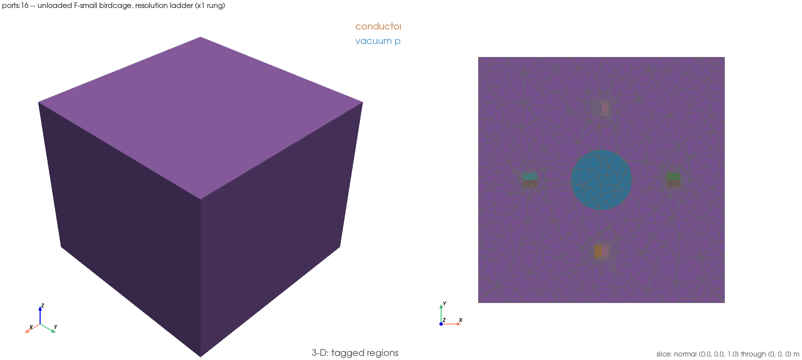

# `ports:16` — the `|B₁⁺|` spread against resolution, the two-rung ladder

Runs `examples/ports/16_birdcage_b1_resolution_ladder.py` (`EX-56`). Two
rungs of the **unloaded** four-leg birdcage at 10 MHz — global mesh sizing
×1 (116 085 cells) and ×0.012 (149 049 cells) — each producing a ccw
quadrature `|B₁⁺|` field for ParaView, asking whether the FEM field's C4
four-copy spread falls as the mesh refines.

## 1. What this demonstrates

Every ladder previously in `examples/ports/` climbs **frequency**
(`ports:5`, `EX-34`; `ports:8`, `EX-40`), never mesh **resolution**. `WF-6`
step 5 (2026-09-13, `tests/validation/test_birdcage_b1_plus_closed_form.py`)
registered a resolution ladder as a convergence statement — the worst-radius
C4 four-copy spread of the quadrature `|B₁⁺|` map on the unloaded F-small
birdcage falls from 5.2506% at ×1 to 2.0719% at ×0.012 — inside a test
module nobody opens in ParaView. This example is the first picture of that
ladder.

The construction is not re-implemented. `LADDER`,
`STEP5_RECORDED_SPREADS`, `STEP5_SPREAD_RTOL` and every helper the rung
needs (`_master_points`, `_read_b1_plus`, `_radial_spreads`,
`_interior_cv`, `_filament_interior_cv`, `VACUUM`) are imported from the
gate module verbatim (`ANS-1`'s rule) — all already exposed at module
scope, so no additive lift was needed. The quadrature machinery
(`_port_index`, `_superpose_dg0`, `quadrature_phase_weights`,
`QUADRATURE_STEP_DEG`) and `_solve_driven` / `build_four_port_sweep` are the
same imports the gate module's own `rung` fixture uses; this example calls
that same construction as a plain function instead of a pytest fixture.

### What it asserts

| anchor | what it is | band / record |
|---|---|---|
| **the fall** | worst-radius C4 four-copy spread of ccw `\|B₁⁺\|`, x1 → x0.012 | `spread(x0.012) < spread(x1)` — the convergence statement itself |
| **the records** | reproduces `STEP5_RECORDED_SPREADS` (5.2506% / 2.0719%) | asserted at `STEP5_SPREAD_RTOL` = 1e-3 **only at `-n 4`** (the gate's record width); printed, width disclosed, at any other width |

**Printed, never asserted** (the gate module's own rule-(e) practice): the
21-point interior CV of `|B₁⁺|` on both rungs, beside the free-space
filament closed form's CV on the same 21 points — context only, since the
FEM domain is shielded and the filament is not.

## 2. How to run it

Needs the complex DolfinX build; the runner sources it for the `ports:`
group automatically.

```
./run_examples.sh -e ports:16 -t 900
```

Through the logging harness, as every verification run must be:

```
scripts/testing/run_and_log.sh EX-56 "./run_examples.sh -e ports:16 -t 900"
```

If the runner fails with `permission denied … /var/run/docker.sock`, run
its inner command verbatim instead:

```
scripts/testing/run_and_log.sh EX-56 "docker compose exec -T fem-em-solver \
  bash -lc 'cd /workspace && source /usr/local/bin/dolfinx-complex-mode && \
  PYTHONPATH=/workspace/src timeout -k 30 560 mpiexec -n 2 python3 \
  examples/ports/16_birdcage_b1_resolution_ladder.py'"
```

## Setup figure



`examples/ports/figures/ports_16_birdcage_b1_resolution_ladder_setup.png`
(259 KiB), rendered on the x1 rung's mesh right after it is built
(`FEM_EM_SETUP_FIGURES=1`): air hidden, the vacuum phantom translucent, the
slice normal to `z` through the plane the 21-point master lattice samples.

## 3. What it read on the run that landed it

`docs/testing/logs/20260914T110730Z_EX-56-control.log`, Status 0, **136 s**
at `-n 2` (not the gate's record width — records printed only):

```
rung       cells    solves   worst-radius spread   record        21-pt CV   filament CV
x1         116085   23.0 s   5.2506%                5.2506% (rel 5.709e-06)   8.1710%    3.5703%
x0.012     149049   38.0 s   2.0719%                2.0719% (rel 6.912e-06)   6.6430%    3.5703%
```

The fall is asserted: `spread(x0.012) 2.0719% < spread(x1) 5.2506%`. Both
rungs reproduced the gate's `STEP5_RECORDED_SPREADS` to ~6e-6 relative even
at `-n 2` — printed for context, not the asserted record test, which needs
`-n 4`.

A first run (`docs/testing/logs/20260914T110437Z_EX-56.log`,
`FEM_EM_SETUP_FIGURES=1`, Status 0, 142 s) produced the same readings and
the setup figure; the control run above reproduces them unflagged and also
carries the corrected ParaView filenames (see §4 caveat 1).

`pgrep -c python3` read 0 before and after both windows.

## 4. How to analyze it, step by step

1. **Read the fixture line first.** `VACUUM phantom (unloaded)`, `-n 2`, and
   the explicit note that this is not the record width — so the record
   comparison below is context, not a gate.
2. **Read each rung's cell count against its `LADDER` record** — 116 085 and
   149 049. A mismatch means the fixture drifted off the one `WF-6` step 5
   measured, and nothing below would be comparable.
3. **Read the worst-radius spread column.** 5.2506% at ×1, 2.0719% at
   ×0.012 — the number this whole item is about.
4. **Read the fall line.** `spread(x0.012) < spread(x1)` is the asserted
   identity; a run where it fails is `EX-56`'s own negative result (report
   to known-issues, stop — no band widens, no rung is added or dropped).
5. **Read the interior CV row for context only.** 8.17% / 6.64% against the
   free-space filament closed form's 3.57% on the same 21 points — printed,
   never asserted, since the FEM domain is shielded (a PEC boundary) and the
   filament closed form has none; the two are not the same physical
   configuration and this is not a homogeneity claim.
6. **Open the two XDMF files** —
   `ports_16_birdcage_b1_resolution_ladder_x1_combined.xdmf` and
   `ports_16_birdcage_b1_resolution_ladder_x0p012_combined.xdmf`, both in
   `examples/ports/paraview_output/`
   (gitignored; referenced here by full filename, never a stem or a glob).
   Each carries `B1_plus_ccw_cg1` (CG1, the production estimator) and
   `CellTags` **on that rung's own mesh** — the two rungs mesh at different
   resolutions, so they are two single-mesh files rather than one temporal
   file (see §5 caveat 2).
7. **Put both files on a common colour range** and step between them:
   that is the picture of the spread narrowing that this item exists to
   produce.

## 5. Scope and caveats — read before quoting a number

* **A convergence statement on one unloaded fixture, 10 MHz, CG1, degree 1,
  F-small.** No closed-form, homogeneity, C95.3, Larmor, tuning or
  human-scale claim — `WF-6` stays 🟡 and §2's B₁⁺ clause keeps its wording.
* **Deviation 1 — filename bug, fixed in this slot.** The first attempt at
  the `x0.012` output file used the rung key's literal dot in the file stem;
  `write_xdmf_with_tags`'s `Path.with_suffix(".xdmf")` treats everything
  after the *last* dot as the suffix to replace, so a stem ending in
  `x0.012_combined` silently truncated to one ending in `x0`, dropping
  `012` and `_combined` from the written name (still valid XDMF content,
  wrong name). Fixed by writing the
  file stem with the dot replaced (`x0p012`) while keeping the dotted key
  as the printed label; the control run above is the corrected one.
* **Deviation 2 — two files, not one combined temporal XDMF.** The §7 item
  asks for "both rungs' `|B₁⁺|` written to one combined XDMF with the rung
  as the time step." The two rungs mesh at different resolutions (116 085 vs
  149 049 cells) and therefore different topologies; `write_xdmf_with_tags`
  is documented single-timestep-only, and this slot did not have time to
  verify an unproven multi-mesh temporal-grid write against the compute
  window. This example writes the two rungs as separate, already-tested
  single-mesh combined files instead (`EX-40`'s pattern) — reported here as
  a deviation, not silently substituted.
* **The ×0.0095 rung stays off.** Its power residual is a banked
  known-issues negative (`WF-6` step 4f, 2026-09-09); nothing here revisits
  it.
* **No power, covariance or gate-(i)/(ii) identity is asserted here.** This
  example asserts only the convergence statement (the fall) and reproduces
  the two spread records; the power-accounting and C4-covariance gates that
  `WF-6` step 5 also reproduces stay inside the gate module.
