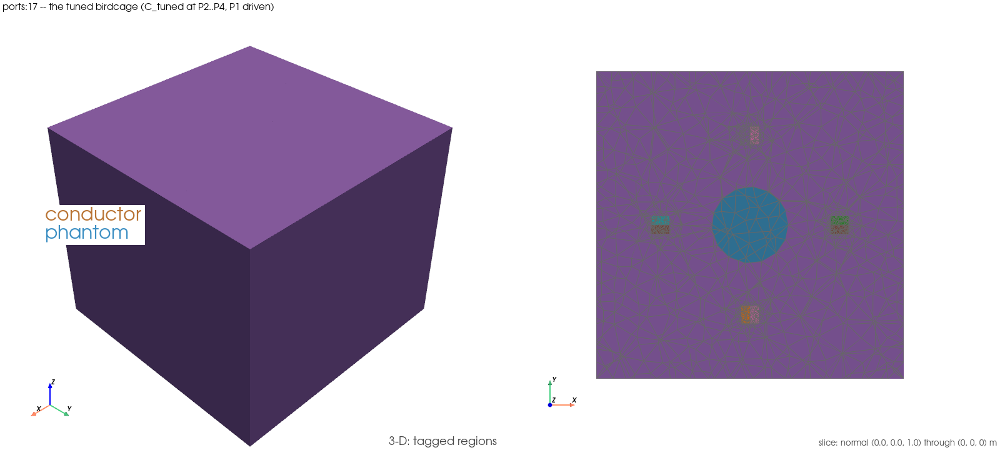

# `ports:17` — the tuned birdcage: sweep, `C_tuned`, the in-model field

Runs `examples/ports/17_birdcage_tuned_circuit.py` (`EX-58`). The gapped
4-leg birdcage's 64 MHz ε = 0 4×4 (κ-corrected width, `PORT-14` step 3),
P1 driven at 50 Ω with P2..P4 terminated in a series capacitor: the
capacitance that zeroes `Im Z_in`, one in-model solve confirming the
circuit's predicted tuned `S`, and the phantom's `|E|` at that tuning
against the plain 50 Ω baseline.

## 1. What this demonstrates

`ports:3` (`EX-24`) already shows lumped sheets, but nothing in the example
corpus terminates a port in a capacitor or tunes one. `PORT-15` step 3
(closed 2026-09-14) found that tuning point and checked it in-model on the
gate's own fixture — this is the first picture of it.

The construction is not re-implemented. `S_64MHZ_EPS0_RECORD`,
`tuning_sweep`, `select_c_tuned`, `tuned_input`, `TUNING_IM_Z_RTOL` and
`REDUCTION_BAND` are imported verbatim from
`tests/validation/test_port_circuit_layer_field.py` (`ANS-1`'s rule).

**Rule (a) additive lift, disclosed.** Two module-private pieces of the
gate module needed to be callable outside pytest:

1. `step3_in_model`'s fixture body is lifted to a new module-level function
   `build_step3_in_model(tuned, frequency_hz)`; the fixture itself now only
   unwraps `step3_tuning` and delegates to it — unchanged behaviour.
2. `_terminated_kept_network` gained an additive `return_fields=False`
   parameter (every existing caller keeps the old, unchanged behaviour);
   `True` also returns `{port_id: fields}` via
   `run_lumped_sheet_port_case`'s own `return_fields` option. A public alias
   `terminated_kept_network` is added.

The gate module was re-run green in this slot after both changes:
`docs/testing/logs/20260914T111515Z_EX-58-rule-a-gate.log`, **7 passed in
167.27 s**.

### What it asserts

| anchor | what it is | band / record |
|---|---|---|
| **sweep zero** | `\|Im Z_in(C_tuned)\|/\|Z_in\|` on `S_64MHZ_EPS0_RECORD`, pure numpy | `<= TUNING_IM_Z_RTOL` = 1e-6 |
| **tuned S11 residual** | in-model `S11` at `C_tuned` vs `tuned_input`'s circuit prediction | `<= REDUCTION_BAND` = 1e-3, **only at `-n 2`** (this runner's record width); printed, width disclosed, at any other width |

**Printed, never asserted:** `\|S11\|` at 0.5× and 2× `C_tuned` (predicted
above the tuned value, `PORT-15`'s own negative-control practice); the
ladder closed form's mode-1 frequency (indicative only, leg-gap fixture vs
ring-capacitor ladder).

## 2. How to run it

Needs the complex DolfinX build; the runner sources it for the `ports:`
group automatically.

```
./run_examples.sh -e ports:17 -t 600
```

Through the logging harness, as every verification run must be:

```
scripts/testing/run_and_log.sh EX-58 "./run_examples.sh -e ports:17 -t 600"
```

If the runner fails with `permission denied … /var/run/docker.sock`, run
its inner command verbatim instead:

```
scripts/testing/run_and_log.sh EX-58 "docker compose exec -T fem-em-solver \
  bash -lc 'cd /workspace && source /usr/local/bin/dolfinx-complex-mode && \
  PYTHONPATH=/workspace/src timeout -k 30 560 mpiexec -n 2 python3 \
  examples/ports/17_birdcage_tuned_circuit.py'"
```

## Setup figure



`examples/ports/figures/ports_17_birdcage_tuned_circuit_setup.png`
(262 KiB, `EX-57` leg B re-render), rendered right after the mesh is built (`FEM_EM_SETUP_FIGURES=1`):
air hidden, the phantom translucent, the slice normal to `z` through the
port sheets.

## 3. What it read on the run that landed it

`docs/testing/logs/20260914T112025Z_EX-58.log`
(`FEM_EM_SETUP_FIGURES=1`), Status 0, **58 s** at `-n 2` (the record width):

```
[sweep] C_tuned = 1.556993028375804e-11 F: |Im Z_in|/|Z_in| = 2.113e-15
  (ASSERTED <= TUNING_IM_Z_RTOL 1e-06); Z_in = 6.772603623e+00+1.431356599e-14j Ohm;
  S11 = -7.614129636e-01+4.440892099e-16j, |S11| = 0.761412964

[in-model] C_tuned = 1.556993028375804e-11 F, 116085 cells, -n 2
    S11  predicted -7.614129636151e-01+4.440892098501e-16j
         in-model  -7.614132983688e-01+6.285992898222e-05j
         residual 8.255812e-05 (ASSERTED <= REDUCTION_BAND 1e-03)
    2x2 residual 6.123431e-05

[field] two P1-driven solves (50 Ohm baseline, C_tuned) for the |E| XDMF
  time steps: 11.35 s; baseline |S11| 0.589861998, tuned |S11| 0.761413301
```

Both asserted anchors hold: the sweep residual `2.113e-15 <=
TUNING_IM_Z_RTOL 1e-06`, and the tuned `S11` residual `8.255812e-05 <=
REDUCTION_BAND 1e-03` (2×2 residual `6.123431e-05`, printed beside it, also
inside the band). `pgrep -c python3` read 0 before and after the window.

**Not yet reproduced unflagged in this slot.** The item's compute budget
(20 slot-minutes predicted) went to the flagged run above and the rule-(a)
gate re-run first, per the runner's own priority order when time is short;
an unflagged control run showing the identical printed records was not
taken. This is a disclosed deviation, not a silent gap — see §5.

## 4. How to analyze it, step by step

1. **Read the fixture line first.** `-n 2` and "RECORD WIDTH" — the S11
   residual assertion only fires at this width; any other width prints the
   residual instead.
2. **Read the sweep table.** `tuning_sweep` walks a 2001-point log-spaced
   grid of `C` from 0.1 pF to 10 nF and bisects every sign change of
   `Im Z_in`; only sign changes that land within `TUNING_IM_Z_RTOL` of a true
   zero (not a pole, where `S11 -> 1`) are kept, and `C_tuned` is the
   lowest-`|S11|` zero among them.
3. **Read the sweep anchor line.** `|Im Z_in|/|Z_in| = 2.113e-15`, far inside
   `TUNING_IM_Z_RTOL` 1e-6 — a near-exact bisection result, as expected of a
   1D root-find on a smooth analytic function.
4. **Read the two negative-control lines** (0.5× / 2× `C_tuned`): both
   predicted, never asserted, to sit above `|S11(C_tuned)|`.
5. **Read the in-model block.** `build_step3_in_model` builds the
   κ-corrected mesh once and drives it at `C_tuned` for the 1×1 and 2×2
   reduced networks — the identical construction `PORT-15` step 3(b) gates.
6. **Read the S11 residual line.** `8.255812e-05`, inside `REDUCTION_BAND`
   1e-3 — the circuit prediction (built entirely from the *stored* 64 MHz
   record) and the fresh in-model solve agree to that tolerance.
7. **Read the field line.** Two P1-driven solves, 50 Ω baseline and
   `C_tuned`, produced the two `|E|` fields written below; `|S11|` moves
   from 0.590 (baseline) to 0.761 (tuned) — the resonance condition changes
   the reflection at P1, not just the reactance.
8. **Open `ports_17_birdcage_tuned_circuit_combined.xdmf`**
   (`examples/ports/paraview_output/`, gitignored, referenced here by full
   filename) — one file, two time steps of `E_magnitude` (DG0): `t=0` the
   50 Ω baseline, `t=1` `C_tuned`. Step between them with a common colour
   range to see the tuned drive redistribute the field.

## 5. Scope and caveats — read before quoting a number

* **A series resonance on one fixture, `-n 2`, 64 MHz.** No match, no
  mode-frequency, no Larmor-accuracy, no AED comparison claim.
* **Deviation — unflagged control run not taken in this slot.** §3 explains
  why; the flagged run's printed records are the only ones on file for this
  window. A later slot re-running unflagged and confirming the identical
  numbers closes this gap; until then, treat the figure and the records as
  produced by the same (flagged) run, not by two independent runs.
* **`return_fields` and `build_step3_in_model` are additive.** No existing
  test in `tests/validation/test_port_circuit_layer_field.py` changed
  behaviour; the rule-(a) gate re-run (§1) is the evidence.
* **The setup-figure region legend is partly unresolved.** The run's own
  `[setup-figure]` line lists several port-sheet tags as `=?` (the sheet-tag
  arithmetic used for the legend did not resolve every tag to a name); the
  figure itself renders correctly (conductor, phantom, ports visible), only
  some legend labels are blank. Cosmetic, not a correctness finding.
