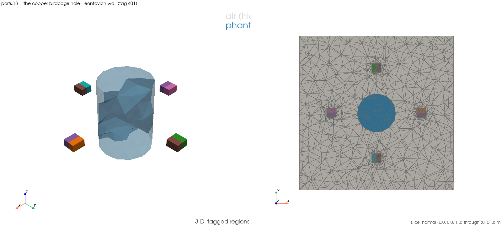

# `ports:18` — the copper birdcage: the surface loss density on the coil

Script: `examples/ports/18_birdcage_copper_leontovich.py` (`EX-59`)
Gate: `tests/validation/test_th14_birdcage_copper.py` (`TH-14` step 2)

## 1. What this demonstrates

`TH-14` step 2 (closed 2026-09-13) replaced the cavity-wall Dirichlet pin
`ports:14` (`EX-54`) used for the PEC hole with Jin §5.8.3's third-kind
surface-impedance term at copper conductivity, on facet tag 401
(`BIRDCAGE_CONDUCTOR_SURFACE_TAG`). This example reproduces the gate
module's own 10 MHz copper branch — the 4-port sweep and the P1 field
solve's power accounting — and adds a DG0 field naming exactly what the
loss on the coil is: the facet-integrated Leontovich loss *per adjacent
cell*, in watts, not a density.

**It asserts, it does not re-implement.** No gate-module edit was needed,
so there is no rule-(a) additive lift and no gate re-run owed. Every
record, band and helper — `_sheets_build`, `_outer_box_tags`,
`_build_ports`, `_problem`, `_leontovich_term`, `_surface_loss_w`,
`_sweep_record`, `COPPER_SIGMA`, `DRIVEN`, `OUTER_BOX_TAG`,
`RECIPROCITY_BAND`, `PASSIVITY_SIGMA_TOLERANCE`, `ADJACENT_SPREAD_BAND`,
`DISCRETE_IDENTITY_RTOL`, `FREQUENCY_HZ`, `PHANTOM_CELL_TAG`,
`_sheet_field_dissipation_w`, `_source_power_w`, `LEG_COUNT` — is imported
directly from the module names the gate module itself uses, unchanged
(`ANS-1`'s rule).

**The case.** `TH-14` step 2's 10 MHz copper branch only: the hole mesh,
the outer-box facet group, the four lumped-sheet ports, one copper 4-port
sweep with the Leontovich term, then the P1 field solve and the power
accounting exactly as the gate module's own `ladder` fixture. The PEC
sweep and the σ ladder are not reproduced — they are not in the §7 row.

**No absolute copper-coil accuracy claim** (`ANS-6`): the copper number is
a model reading on this fixture, not a validated accuracy figure.

## 2. How to run it

Needs the complex DolfinX build; the runner sources it for the `ports:`
group automatically.

```
./run_examples.sh -e ports:18 -n 2 -t 300
```

No gate-module edit, so no gate re-run is owed. Verification runs go
through the logging harness with the runner's emitted command
(`./scripts/run_examples.sh -e ports:18 --dry-run`), never with the host
runner wrapped inside it. Add `-e FEM_EM_SETUP_FIGURES=1` after `exec -T`
to re-render the setup figure.

Tier: **standard** (host-runner window ≤ 300 s; 35 s measured at `-n 2`).

## Setup figure



`examples/ports/figures/ports_18_birdcage_copper_leontovich_setup.png`,
rendered right after the mesh is built (`FEM_EM_SETUP_FIGURES=1`): air
hidden, the phantom translucent, the slice normal to `z` through the port
sheets and the cavity wall.

## 3. What it read on the run that landed it

`docs/testing/logs/20260914T124230Z_EX-59.log` (flagged, Status 0, 35 s at
`-n 2`), matching the gate's own 10 MHz copper reading
(`20260914T021500Z_TH-14.log:1032–1037, 1054–1055`) to every printed digit:

| reading | this run | gate log |
|---|---|---|
| `Z_s` | 8.250226e-04(1+j) Ω (`:904`) | `:1032` |
| copper 4×4 `S` | identical to 9 digits (`:905–908`) | `:1033–1036` |
| `σ_max(S)` | 0.999994231395 (`:910`) | `:1037` |
| `P_src` / `ΣP_sheet` | 2.658065874e-03 / 2.657170000e-03 W (`:913`) | `:1054` |
| `P_surf` (the coil) | 8.321237084e-07 W (`:913`) | `:1054` |
| `P_coil/P_in`, `P_phantom/P_in` | 9.288392e-01, 7.116081e-02 (`:914`) | `:1055` |
| per-cell field sum vs `P_surf` | rel 1.527e-15 (`:918`) | — |

The σ = 800 solid control's `P_(Ω∖phantom)/P_in` prints as 9.998742e-01
(`:916`). That is a different fixture with a different loss mechanism (a
volume conductor), so read it as context, not a bracket. The identity
residual is roundoff-level (1.572e-13 here, 1.575e-13 in the gate).

In outline, the run prints:

* `[fixture]` — hole mesh cell count, mesh+ports build time, the outer-box
  census;
* `[sweep]` — `Z_s`, the copper 4×4 `S`, and reciprocity / passivity /
  class-spread against their imported bands (`ALL IMPORTED GATES HOLD`);
* `[field]` — the P1 copper field solve's power accounting: `P_src`,
  `ΣP_sheet`, `P_phantom`, `P_(Ω∖phantom)`, `P_surf`, and the identity
  residual against `DISCRETE_IDENTITY_RTOL`;
* `PRINTED: P_coil/P_in`, `P_phantom/P_in` — the copper shares;
* `[printed, no band]` — the copper `P_coil/P_in` beside the σ = 800 solid
  control's `P_(Ω∖phantom)/P_in` (`TH-15` step 3c log, read verbatim, not
  recomputed);
* `[consistency]` — the DG0 per-cell loss field's sum over owned dofs
  against `P_surf` (true by construction, DG0 partition of unity);
* `[output]` — the combined XDMF path.

## 4. How to analyze it, step by step

**Step 1 — read the fixture line.** Cell count and the outer-box census
(exterior facets split into the cavity wall, tag 401, and everything
else).

**Step 2 — read `[sweep]` and `[gates]`.** Reciprocity, passivity and the
three C4 class spreads against their imported bands — all four assertions
use exactly the gate module's own bands. `ALL IMPORTED GATES HOLD`
confirms it.

**Step 3 — read `[field]`.** The power identity: `P_src − ΣP_sheet =
P_phantom + P_(Ω∖phantom) + P_surf`, residual asserted against
`DISCRETE_IDENTITY_RTOL`. `P_surf > 0` is asserted separately.

**Step 4 — reproduce to the digit.** Compare this run's `Z_s`, `P_src`,
`ΣP_sheet`, `P_phantom`, `P_surf` and the residual against `TH-14` step 2's
own 10 MHz copper reading:
`docs/testing/logs/20260914T021500Z_TH-14.log:1032` (`Z_s`),
`:1054` (`P_src`, `ΣP_sheet`, `P_phantom`, `P_surf`, residual) and
`:1055` (`P_coil/P_in`, `P_phantom/P_in`). A miss beyond print rounding is
an example/test **divergence** — a known-issues entry naming this example
and a stop, never a re-record from the example side.

**Step 5 — read `[printed, no band]`.** The copper `P_coil/P_in` beside the
σ = 800 S/m solid control's share on a *different* fixture (`TH-15` step
3c). Not a bracket, not an accuracy claim — a printed reference only.

**Step 6 — read `[consistency]`.** The DG0 per-cell loss field's sum over
owned dofs against `P_surf`: true by construction (DG0 partition of
unity), asserted at `DISCRETE_IDENTITY_RTOL`.

**Step 7 — open the mesh in ParaView.**
`examples/ports/paraview_output/ports_18_birdcage_copper_leontovich_combined.xdmf`.

- Colour the cell grid by `coil_surface_loss_per_cell_W` (DG0) — watts per
  cell adjacent to facet tag 401, **not a density**.
- Threshold `CellTags` on `PHANTOM_CELL_TAG` and colour by `E_magnitude`
  (DG0) to see the field in the saline phantom.
- The facet grid carries facet group 401 (the cavity wall) alongside the
  four sheet tags.

**Step 8 — what a deviation means.** Every gated anchor is imported from
`TH-14` step 2's gate module, so a miss through this script's path is an
example/test divergence, not a new physics finding — a known-issues entry
naming this example and a stop, never a loosened band and never a
re-record from the example side.

## Related

- The PEC-hole route (no copper, no Leontovich term): `examples/ports/14_birdcage_pec_hole_ports.md`.
- `TH-14` step 2's gate module: `tests/validation/test_th14_birdcage_copper.py`.
- The σ = 800 S/m solid control this example prints beside its copper
  reading: `TH-15` step 3c, `PROJECT_PLAN.md` §7.
