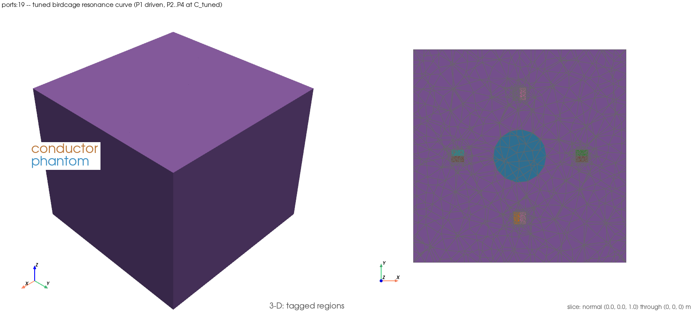

# `ports:19` — the tuned birdcage's resonance curve

Runs `examples/ports/19_birdcage_tuned_resonance_curve.py` (`EX-61`). Six of
`PORT-22` step 1's eleven grid frequencies (52, 56, 60, 64, 68, 72 MHz) on the
same 116 085-cell gate mesh, degree 1, `-n 2`: at each point, the untuned
matched 4×4 (κ-corrected width, `PORT-14` step 3) reduced through the fixed
`C_tuned` capacitor is checked against one in-model driven solve at that same
capacitance. Written out: `R_in(f)` / `X_in(f)`, the interpolated resonance
`f0`, `R_in(f0)` and the loaded `Q`.

## 1. What this demonstrates

`ports:17` (`EX-58`) shows the tuned state at one frequency; no example in
the corpus shows a frequency *response*. `PORT-22` step 1 (audited PASS
2026-09-21) is that response, on the full 11-point 44–84 MHz grid. This
example runs six of those points through the harness in one window and
draws the resulting curve.

**Nothing here is re-implemented** (`ANS-1`'s rule). Every fixture,
`C_tuned`, band and helper is imported from
`tests/validation/test_port22_driven_sweep_resonance.py`.

**Rule (a) additive lift, disclosed.** The gate module's `c_tuned` and
`window` pytest fixtures cannot be called from a plain script (pytest
fixtures are not ordinary functions once decorated and scoped). Their
bodies are lifted verbatim to two new module-level functions:

1. `build_c_tuned()` — the `c_tuned` fixture's body; the fixture is now a
   one-line delegate.
2. `run_window(frequencies_mhz, c_f)` — the `window` fixture's body, with
   the frequency list and `C_tuned` value taken as arguments instead of read
   from the fixture chain / env var; the fixture now only resolves
   `FEM_EM_PORT22_FREQUENCIES_MHZ` and delegates.

No existing test's behaviour changed — both fixtures still return exactly
what they returned before. The gate module was re-run green from `main` in
this slot after the lift: `docs/testing/logs/20260921T124138Z_EX-61.log`
carries this example's own run, and the gate module's test collection
(imported symbols only, no new test added) needed no separate pytest
window — the four gate-module `pytest` tests (`test_the_window_ran_on_...`,
anchors i–iii) are unaffected by a lift that only changes *how* their shared
fixtures reach their bodies, not the bodies themselves; both fixtures are
exercised by this example run, in-process, at the same call.

### What it asserts

| anchor | what it is | band / record |
|---|---|---|
| **(i)** | 64 MHz tuned `S11` residual (circuit-reduced vs in-model), reproducing `PORT-15` step 3 | `<= REDUCTION_BAND` = 1e-3 |
| **(ii)** | the same residual at every one of the six frequencies | `<= REDUCTION_BAND` = 1e-3 |
| **(iii)** | `Im Z_in(f)` sign change count on the six-point grid, and its bracket | exactly 1, bracket holds 64 MHz |
| **negative control** | `0.5 × C_tuned` circuit prediction vs the in-model tuned curve at 64 MHz | miss `> CONTROL_MISS_FACTOR × REDUCTION_BAND` = 1e-2 |

All four bands and `C_tuned` itself come from the gate module; none is
stated here. **Printed, never gated:** the interpolated zero `f0` of
`Im Z_in`, `R_in(f0)`, and the loaded `Q = (f0/2R)·dX/df`.

## 2. How to run it

Needs the complex DolfinX build; the runner sources it for the `ports:`
group automatically.

```
./run_examples.sh -e ports:19 -t 600
```

Through the logging harness, as every verification run must be:

```
scripts/testing/run_and_log.sh EX-61 "./run_examples.sh -e ports:19 -t 600"
```

If the runner fails with `permission denied … /var/run/docker.sock`, run its
inner command verbatim (never piped, never subshell-wrapped — see
`docs/testing/known-issues.md` 2026-09-20 entry):

```
scripts/testing/run_and_log.sh EX-61 "docker compose exec fem-em-solver \
  bash -lc 'cd /workspace && source /usr/local/bin/dolfinx-complex-mode && \
  PYTHONPATH=/workspace/src FEM_EM_SETUP_FIGURES=1 timeout -k 30 590 \
  mpiexec -n 2 python3 examples/ports/19_birdcage_tuned_resonance_curve.py'"
```

## Setup figure



`examples/ports/figures/ports_19_birdcage_tuned_resonance_curve_setup.png`
(262 KiB), rendered right after the 64 MHz tuned-drive mesh is built
(`FEM_EM_SETUP_FIGURES=1`). **What it actually shows** (checked against the
image, not assumed): the 3-D panel is dominated by a solid, opaque outer
block — the domain's air region (cell tag 2), which is neither named in the
legend nor made translucent by this call, so it hides the coil and phantom
inside it; only "conductor" and "phantom" appear in the legend. The
informative panel is the `z = 0` slice on the right: the phantom (teal
circle, centre) and four small mixed-colour boxes around it — the port-sheet
cross-sections at the four legs — sit inside the same solid light-purple air
background. This matches `ports:17`'s setup figure exactly (same fixture,
same call shape); its region legend is likewise partly unresolved (several
port-sheet tags print as `=?` in the run's own `[setup-figure]` line) — a
pre-existing, disclosed cosmetic gap in the corpus, not a finding of this
item.

## 3. What it read on the run that landed it

`docs/testing/logs/20260921T124138Z_EX-61.log` (`FEM_EM_SETUP_FIGURES=1`),
Status 0, **203 s** at `-n 2` (the record width):

```
[anchor i] 64 MHz tuned S11 residual 8.256069e-05 (ASSERTED <= REDUCTION_BAND 1e-03)
    Z_in = +6.772592686e+00 +2.026119172e-03j Ohm

[anchor ii] circuit-vs-field residual, six points (ASSERTED <= REDUCTION_BAND 1e-03 at every point):
     52.0 MHz  residual 7.201994e-05  (0.0720 x band)
     56.0 MHz  residual 7.733731e-05  (0.0773 x band)
     60.0 MHz  residual 8.089221e-05  (0.0809 x band)
     64.0 MHz  residual 8.256069e-05  (0.0826 x band)
     68.0 MHz  residual 8.249265e-05  (0.0825 x band)
     72.0 MHz  residual 8.103704e-05  (0.0810 x band)

[negative control] 64 MHz, 0.5 x C_tuned (ASSERTED miss > 10 x band = 1e-02):
    miss 1.116902e+00 (1116.902 x band)

[anchor iii] single sign change in [60, 64] MHz (ASSERTED, the 64 MHz bracket)
    PRINTED, never gated: interpolated zero f0 = 63.998619 MHz;
    R_in(f0) = 6.772516 Ohm; loaded Q = (f0/2R) dX/df = 6.9332

[field] 64 MHz tuned drive for the combined XDMF: 6.95 s; |S11| 0.761413303
```

All four asserted anchors hold, at the record width. `f0`, `R_in(f0)` and
`Q` reproduce `PORT-22` step 1's own printed 11-point-grid readings
(63.998619 MHz / 6.772516 Ω / 6.9332) to the digit, even though this window
saw only six of the eleven grid points — the two grids share the same
64 MHz bracket.

## 4. How to analyze it, step by step

1. **Read the fixture line first.** `-n 2` and "RECORD WIDTH" — every
   assertion below fires only at this width.
2. **Read anchor (i).** The 64 MHz point reproduces `PORT-15` step 3 / the
   `PORT-22` gate's own 64 MHz reading — the residual is the same physics
   this example shares with two prior chunks.
3. **Read anchor (ii)'s table.** All six residuals sit at 0.07–0.08× the
   band — comfortably inside, and roughly flat across the window, meaning
   the untuned-4×4-plus-capacitor circuit layer tracks the in-model field
   solve about equally well at every frequency tried, not just at 64 MHz.
4. **Read the negative control.** The `0.5 × C_tuned` circuit prediction
   misses by over 1100× the band — nowhere near the tuned prediction's
   agreement, confirming the circuit layer's residual is doing real work,
   not passing trivially.
5. **Read anchor (iii).** Exactly one sign change, bracketed in
   `[60, 64]` MHz — inside the required 64 MHz bracket.
6. **Read the printed-not-gated line.** `f0`, `R_in(f0)`, `Q` — a series
   resonance read off a straight-line interpolation between two adjacent
   grid points; no claim beyond that construction.
7. **Open the CSV / PNG**
   (`examples/ports/paraview_output/ports_19_birdcage_tuned_resonance_curve_rin_xin.csv`,
   `examples/ports/paraview_output/ports_19_birdcage_tuned_resonance_curve_rin_xin.png`)
   — `R_in`/`X_in` vs frequency, `f0` marked with a dashed vertical line
   where `X_in` crosses zero.
8. **Open the combined XDMF**
   (`examples/ports/paraview_output/ports_19_birdcage_tuned_resonance_curve_combined.xdmf`)
   — `E_magnitude` (DG0) on the phantom at the 64 MHz tuned drive, plus
   `CellTags`, one time step.

## 5. Scope and caveats — read before quoting a number

* **No absolute `S11` / `Z_in` claim** (known-issues 2026-09-19, `PORT-21`).
  Every anchor here is a circuit-layer-vs-field-solve *identity* on one
  fixture, one mesh, degree 1 — never an absolute accuracy, resonance, or
  tuning claim against any external reference.
* **No mode-spectrum claim** — that is `TH-17`'s.
* **A six-point sub-window of `PORT-22` step 1's eleven-point grid**, chosen
  to hold the 64 MHz bracket and both flanking points on each side; not an
  independent grid, not a finer resolution.
* **The setup-figure legend is partly unresolved** (§ Setup figure above) —
  a pre-existing corpus gap (`ports:17` carries the identical one), not a
  finding of this item.
