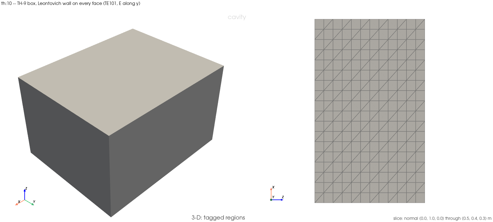

# `th:10` — the lossy-wall cavity: Q against σ beside Pozar

Script: `examples/time_harmonic/10_lossy_wall_cavity_q.py` (`EX-60`)
Gate: `tests/validation/test_cavity_leontovich_q.py` (`TH-14` step 1)

## 1. What this demonstrates

`th:2` (`EX-5`) solves the `TH-9` 1.0 × 0.8 × 0.6 m box with PEC walls, where
the eigenvalues are real and Q is infinite. This example keeps the box and the
TE₁₀₁ mode and changes only the **boundary model**. Every wall carries Jin
§5.8.3's third-kind surface-impedance (Leontovich) term with
`Z_s = (1 + j)√(ω₀μ₀/(2σ))`. The pencil turns complex, the eigenvalue gains
Im λ, and `Q = Re ω / (2|Im ω|)` with `ω = c√λ`.

Everything is imported from the gate module: the rungs (σ = 1e4, 1e6, 5.8e7
on the fine (9, 7, 6) mesh, degree 2), the bands and Pozar's closed form
`Q_c` (`pozar_te10l_q_conductor`). Nothing is restated. The solver is the
gate's own `solve_impedance_wall_cavity_mode`, with one additive keyword,
`return_mode=False`, so the example can export the eigenfunction whose Q it
asserts. With the flag off, the eigenvalues are read exactly as before, and
the gate module was re-run green in the same slot.

Asserted:

- **(a)** σ = 1e4: `|Q/Q_c − 1| ≤ Q_TOLERANCE` (5 %), and Re f within
  `TH9_FREQUENCY_BAND` (1 %) of the PEC control;
- **(b)** the √σ identity, `Q(1e6)/Q(1e4) = 10` within `SCALING_TOLERANCE` (5 %);
- **negative control:** the PEC pencil, solved the same non-Hermitian way,
  `|Im λ|/Re λ ≤ CONTROL_IM_RE_BOUND` (1e-10);
- the damping sign, Im ω > 0 on both lossy rungs;
- **the exported mode is the asserted mode:** the generalized Rayleigh quotient
  `(∫|∇×E|² + γ∫|n×E|²)/∫|E|²` of the written eigenfunction equals the
  solver's λ to 1e-6 relative.

Printed only: copper (σ = 5.8e7) beside its `Q_c`, as the PEC-limit reading,
and the wall RMS `|n × E|` over the volume RMS `|E|` beside `|Z_s|/η₀`. That
ratio would be zero on a PEC wall. One box, one mode, no coil. None of this is
a claim about a coil's conductor loss (`ANS-6`).

## 2. How to run it

```
./run_examples.sh -e th:10 -n 2 -t 300
```

Needs the complex DolfinX build, which the runner sources for the `th:` group.
Tier: **standard**. The gate's solves took 9.2 s in a 45 s window.
Verification runs go through the logging harness with the runner's emitted
command (`./scripts/run_examples.sh -e th:10 --dry-run`). Add
`-e FEM_EM_SETUP_FIGURES=1` after `exec -T` to re-render the setup figure.

## Setup figure



`examples/time_harmonic/figures/time_harmonic_10_lossy_wall_cavity_q_setup.png`.
The solver builds the mesh internally, so the figure is rendered on the σ = 1e4
rung's mesh right after that solve returns. It shows one homogeneous region,
the vacuum cavity, sliced normal to y (the TE₁₀₁ E-field direction).

## 3. How to analyze it, step by step

**Step 1 — the rung lines.** Each `[pec]`, `[gate]`, `[scaling]` and
`[copper]` line prints in the gate fixture's own format, so it compares line
for line with `docs/testing/logs/20260914T004807Z_TH-14.log:96–99`. A miss
beyond print rounding is an example/test divergence, never a re-record.

**Step 2 — `[control]`.** On the PEC pencil, Im λ is at round-off. The damping
in the next lines therefore comes from the wall term, not from the solver.

**Step 3 — `[a]` and `[b]`.** Q against Pozar at σ = 1e4, then the ratio of the
1e6 and 1e4 Q values against √100 = 10. Pozar's closed form is a perturbation
result (R_s is taken at the PEC frequency), which is why its band is 5 % and
not tighter.

**Step 4 — copper.** Q is roughly 7.6× the σ = 1e6 value, as √58 predicts, and
Im λ/Re λ sits many orders above the PEC control. This is the PEC-limit
reading, printed without a band.

**Step 5 — `[mode]`.** The Rayleigh quotient ties the XDMF field to the
asserted λ. The wall-to-volume RMS ratio is O(|Z_s|/η₀). A PEC wall would pin
it to the interpolation floor.

**Step 6 — ParaView.** Open
`examples/time_harmonic/paraview_output/time_harmonic_10_lossy_wall_cavity_q_combined.xdmf`
and colour by `E_magnitude_normalised`. There is one half-wave along x and
along z and none along y, the same picture as `th:2`'s PEC mode. At this
loss the pattern is visually identical, because the wall's effect is in Im λ,
not in the shape.

## Related

- The PEC box and its real spectrum: `examples/time_harmonic/02_pec_cavity_resonances.md`.
- The gate module: `tests/validation/test_cavity_leontovich_q.py`.
- The same Leontovich term on the copper birdcage: `examples/ports/18_birdcage_copper_leontovich.md`.
